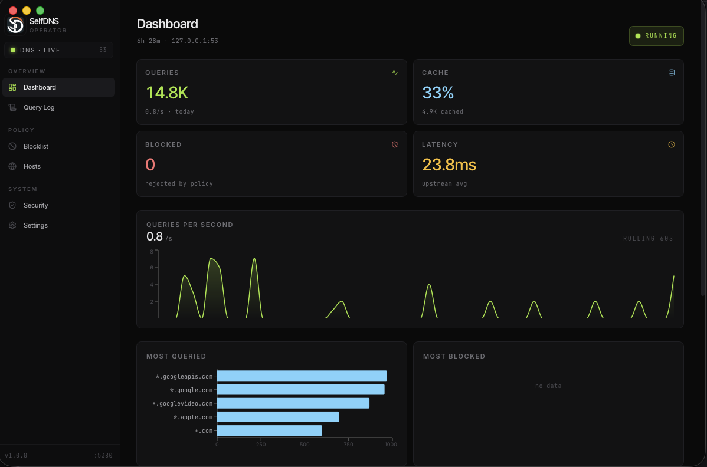
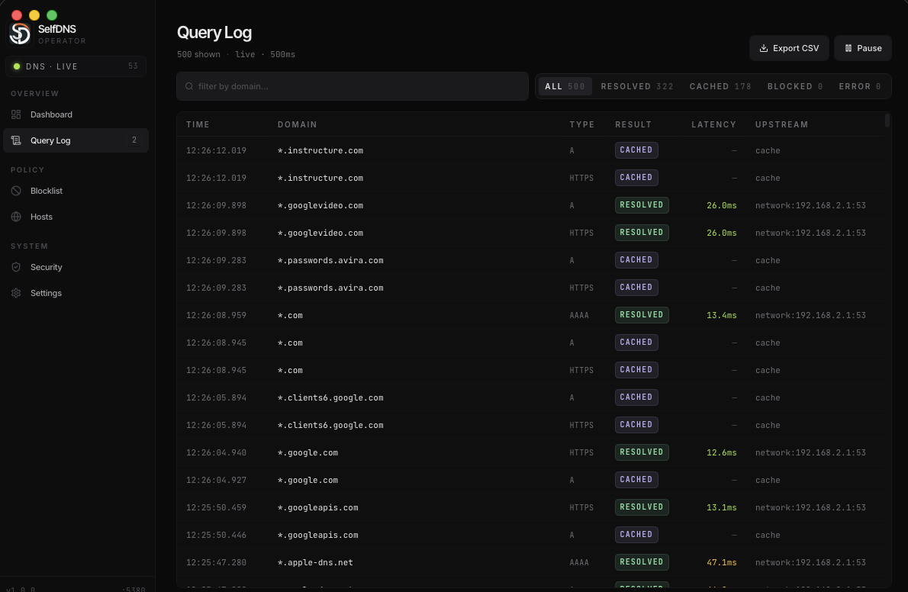
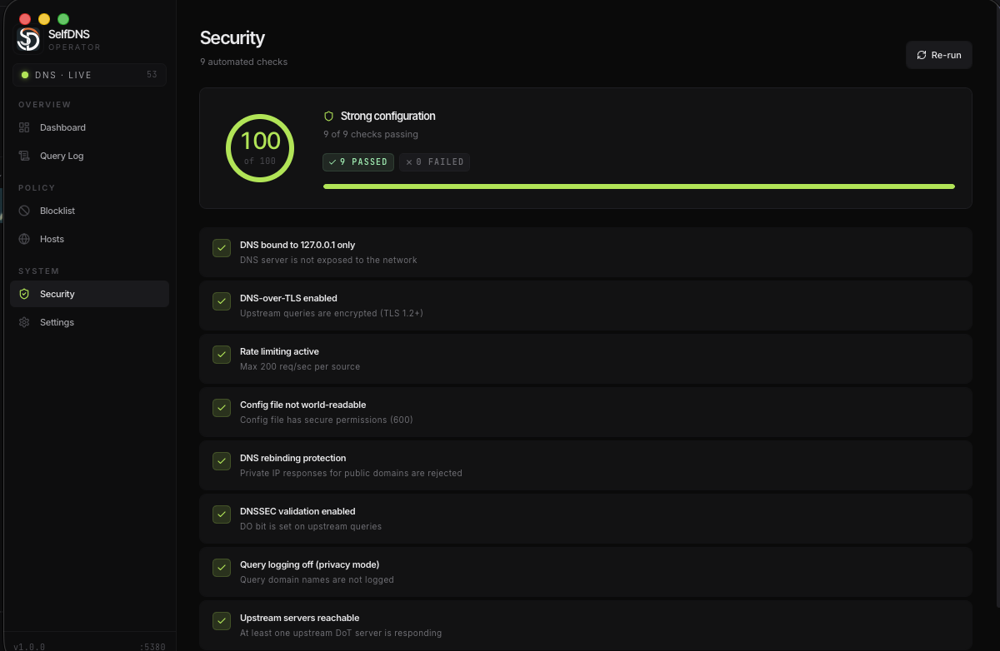

# Self DNS


A Self DNS is a DNS server running locally on your computer.
Your queries remain private and secure within your system. 
If a query cannot be resolved, locally, the system automatically falls back through a reliable sequence: 
Computer → Router → Cloudflare → Google → Quad9.
All Queries are encrypted using DNS Over TLS (DOT), which can protect your data. 

---
# Preview




---
# Quick Start
- macOS / Linux: 
``` curl -fsSL https://raw.githubusercontent.com/belsia-dev/Self-DNS/refs/heads/main/install/install.sh | bash ```
- Windows PowerShell: 
``` irm https://raw.githubusercontent.com/belsia-dev/Self-DNS/refs/heads/main/install/install.ps1 | iex ```

Both installers can clone the repository for you, install missing `git`, `go`, `node`/`npm`, and `wails` after confirmation, then run the Wails build automatically. On macOS, `install.sh` also moves the finished `.app` bundle into `/Applications`.

---

# What it supports
- Dns Over Tls (DOT)
- Security Audit Logs
- Query logs
- Custom host names (something.local)
- Blocklist
- And more
---

## License

Apache 2.0 — see [LICENSE](LICENSE).

Built with [miekg/dns](https://github.com/miekg/dns), [Wails](https://wails.io),
[React](https://react.dev), [Recharts](https://recharts.org), and [TailwindCSS](https://tailwindcss.com).

---

If you like it, Please leave a STAR!